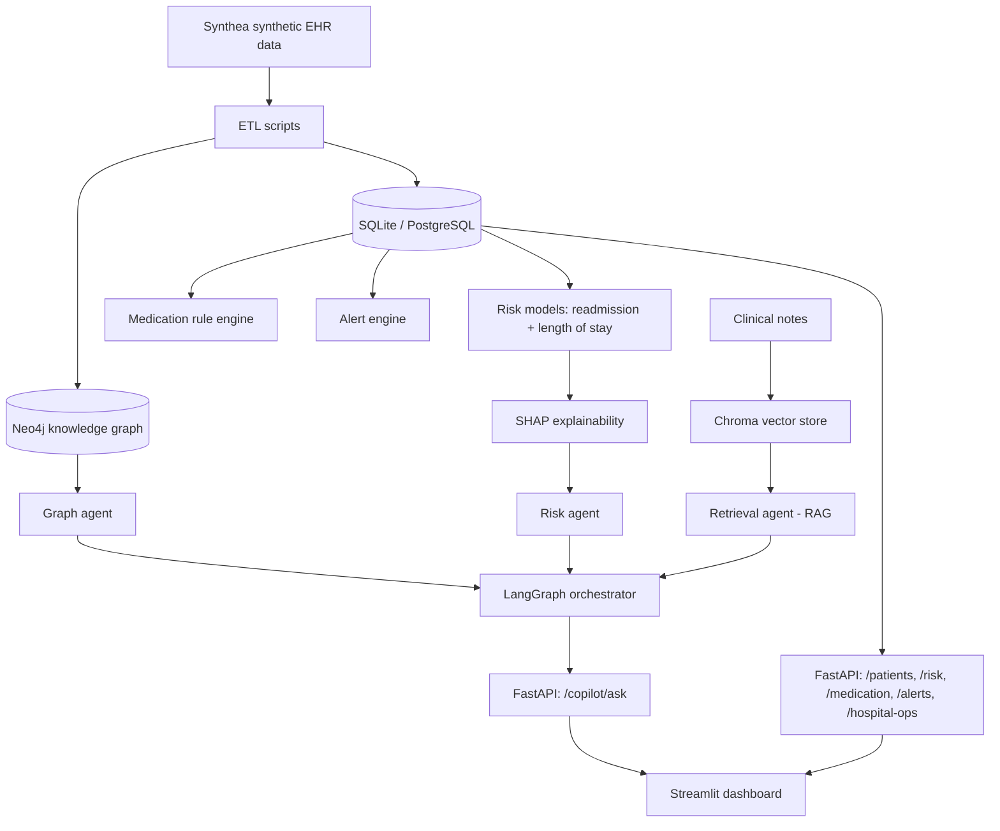

# Architecture

## System Overview

The Clinical Intelligence Platform is organized into five layers: data ingestion, persistence, intelligence (ML + graph + RAG), API, and presentation. Each layer is independently testable and communicates through well-defined interfaces, allowing the underlying data source, models, or LLM provider to be replaced without changing downstream components.

## Data Flow

## Components

### Data Layer

Patient data is generated by Synthea and loaded into a relational schema (`backend/app/models/patient.py`) covering patients, encounters, conditions, medications, lab results, allergies, procedures, and providers. The default persistence layer is SQLite, with the schema also compatible with PostgreSQL for multi-user deployments via a single connection-string change.

### Knowledge Graph

A Neo4j graph is built from the relational data (`data/etl/build_knowledge_graph.py`), modeling patients and their relationships to conditions, medications, allergies, procedures, and treating physicians. The graph enables direct relationship queries, for example, retrieving a patient's full clinical context in a single traversal — that would require multiple relational joins otherwise.

### Risk Prediction Engine

Two XGBoost models are trained on features derived from encounter history (`backend/app/ml/`):

- **Readmission risk** (classification): predicts the probability of an inpatient readmission within 30 days, labeled via an encounter-gap heuristic.
- **Length of stay** (regression): predicts expected length of stay in days.

Both models are paired with SHAP explainers, so every prediction returns not just a score but the features that drove it, satisfying the explainability requirement at the model level rather than as a post-hoc addition.

Gradient-boosted trees were chosen over deep learning models because the dataset size (hundreds of patients) is better suited to tree-based methods, and SHAP's TreeExplainer gives exact, fast attributions for this model class.

### Medication Safety Engine

Drug interaction, allergy conflict, and duplicate-therapy checks (`backend/app/services/medication_rules.py`) are rule-based rather than model-based , safety-critical checks are deterministic and auditable by design, matched against a reference interaction dataset (`data/reference/drug_interactions.json`).

### AI Clinical Copilot

The copilot (`backend/app/agents/`) is a three-agent system orchestrated with LangGraph:

1. **Graph agent** : answers structural/historical questions directly from the Neo4j graph. Fully grounded, no LLM call.
2. **Risk agent** : formats risk model output (score + SHAP factors) into natural language. Also fully grounded, no LLM call.
3. **Retrieval agent (RAG)** : for open-ended clinical questions, retrieves relevant chunks from a Chroma vector store of clinical notes (OpenAI embeddings) and synthesizes an answer with an LLM, constrained to the retrieved context.

A deterministic keyword router directs each question to the appropriate agent, keeping routing logic inspectable rather than delegating it to another model call. Every copilot response returns an answer, evidence sources, and a confidence score.

### Alert Center

Aggregates signals from the risk engine, medication safety engine, and lab results (checked against reference ranges) into a per-patient or hospital-wide feed (`backend/app/api/alerts.py`).

### Hospital Operations

Department-level capacity, staffing, and utilization metrics (`backend/app/services/hospital_ops_simulator.py`) are simulated, as no available dataset, including Synthea, provides real hospital operations data.

### API and Dashboard

FastAPI (`backend/app/api/`) exposes each module as a REST endpoint. The Streamlit dashboard (`dashboard/app.py`) consumes these endpoints to present patient records, risk scores, alerts, population-level risk distribution, and the copilot in a single interface.

## Design Decisions

| Decision | Rationale |
|---|---|
| XGBoost over deep learning for risk models | Dataset scale favors tree-based models; SHAP integration is exact and fast |
| Rule-based medication safety, not ML | Safety-critical logic should be deterministic and auditable |
| Deterministic keyword router for the copilot | Three well-separated intents don't need a model call to route; keeps routing inspectable |
| Only the retrieval agent calls an LLM | Minimizes cost and latency; two of three agents are fully grounded in computed data |
| Streamlit for the dashboard | Rapid iteration without a separate frontend build/deploy pipeline |

## Scope and Limitations

This system is built at demonstration scale (hundreds of synthetic patients) rather than production scale (millions of patients across a hospital network). Specifically out of scope:

- Live EHR/HL7/FHIR integration with hospital systems
- High-availability infrastructure and horizontal scaling
- Production-grade role-based access control and audit logging
- Federated learning, medical imaging analysis, and clinical trial matching (optional extensions in the original specification)

Risk models are trained on synthetic data with heuristic labels and are not clinically validated. Medication interaction data is illustrative, not sourced from a licensed drug database. These are documented limitations of a demonstration system, not implementation gaps.

## Future Work

- Migrate the persistence layer to PostgreSQL for concurrent multi-user access.
- Replace the encounter-gap readmission heuristic with clinically validated labels.
- Move alert generation from on-request computation to an event-driven pipeline for real-time triggering at scale.
- Extend the risk engine with additional targets (e.g., sepsis) given a sufficiently large and clinically labeled dataset.
